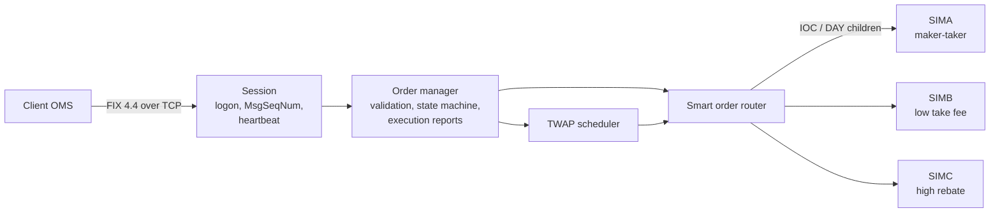

# FIX Order Routing Simulator

A small, working model of an equity and options order router: a **FIX 4.4 acceptor over TCP/IP**, an
**order state machine**, a **smart order router** across three simulated venues, and a **TWAP** strategy,
with the business-analysis documents you would write for it.

Built as a hands-on study of order routing: how an order moves from a client, through a router, to
exchanges and back, and how every step is expressed in FIX.

## Run it

```bash
python -m fixsim.server               # terminal 1: FIX acceptor on 127.0.0.1:9878
python -m fixsim.client               # terminal 2: scripted client walks the order lifecycle
python -m pytest                      # 33 tests, under a second
```

Python 3.10+ with no runtime dependencies (pytest for the tests).

## What the client sees

```
== 1. Buy 400 AAPL @ 190.00 DAY: sweep best price across venues, rest the remainder for rebate
  <- ExecutionReport    New             New              ClOrdID=A1   Cum=0    Leaves=400  AvgPx=0
  <- ExecutionReport    Trade           PartiallyFilled  ClOrdID=A1   Cum=100  Leaves=300  AvgPx=190       100 @ 190 on SIMB
  <- ExecutionReport    Trade           PartiallyFilled  ClOrdID=A1   Cum=300  Leaves=100  AvgPx=190       200 @ 190 on SIMA

== 2. Replace A1 -> A2: raise to 500 @ 190.01, re-route the new leaves
  <- ExecutionReport    PendingReplace  PendingReplace   ClOrdID=A2   Cum=300  Leaves=100  AvgPx=190
  <- ExecutionReport    Replaced        PartiallyFilled  ClOrdID=A2   Cum=300  Leaves=200  AvgPx=190
  <- ExecutionReport    Trade           Filled           ClOrdID=A2   Cum=500  Leaves=0    AvgPx=190.004   200 @ 190.01 on SIMB

== 3. Cancel A2 after it is filled: refused, too late to cancel
  <- OrderCancelReject  Order already filled
```

The full script also covers an IOC remainder cancel, a listed-option order, a business reject, a TWAP
worked in three slices, TestRequest/Heartbeat and Logout.

## How it fits together



**Routing rule:** take every price level within the limit across all venues, best price first; at the
same price, the venue with the lowest take fee first. A DAY limit remainder rests on the venue that pays
the highest maker rebate. IOC and market remainders are canceled, and FOK is all-or-nothing.

## What is modeled

| Area | Detail |
|---|---|
| FIX codec | Tag=value encoding with BodyLength (9) and CheckSum (10), strict validation, TCP stream framing |
| Session | Logon handshake, MsgSeqNum enforcement (too low: Logout; gap: ResendRequest), TestRequest/Heartbeat, session Reject (35=3) |
| Messages | NewOrderSingle (D), OrderCancelRequest (F), OrderCancelReplaceRequest (G), ExecutionReport (8), OrderCancelReject (9) |
| Order lifecycle | New, Partially filled, Filled, Pending cancel, Canceled, Pending replace, Replaced, Rejected; CumQty / LeavesQty / AvgPx reconciled on every report |
| Venues | Limit order books with price-time priority, maker-taker fees, self-trade prevention |
| Products | U.S. equities, and listed options (SecurityType OPT with expiry, put/call and strike) |
| Strategy | TWAP via TargetStrategy 847=1000 and TargetStrategyParameters 848 |

## Business-analysis documents

| Document | Contents |
|---|---|
| [Requirements](docs/requirements.md) | Stakeholders, business requirements, 18 functional requirements with acceptance criteria, non-functional requirements, scope limits |
| [Message flows](docs/message-flows.md) | Sequence diagrams between client, router and venues for every flow |
| [Order lifecycle](docs/order-lifecycle.md) | State diagram, ExecType vs OrdStatus, quantity rules with a worked example |
| [Data model](docs/data-model.md) | Entity-relationship diagram, entity dictionary, identifier rules |
| [FIX tag mapping](docs/fix-tag-mapping.md) | Every tag in and out, whether it is required, where it lives in the model, and its validation rule |
| [Test scenarios](docs/test-scenarios.md) | Use cases and a traceability matrix from each requirement to its tests |

## Deliberate simplifications

No message store or gap fill, one client session at a time, no outbound heartbeat timer, no market-data
feed or NBBO, and no Reg NMS order-protection checks. Fees drive routing but are not reported back.
Details are in [requirements §6](docs/requirements.md#6-out-of-scope-and-simplifications).

## Layout

```
fixsim/  fix.py (codec) · session.py (TCP session) · engine.py (order manager, TWAP) · router.py (SOR)
         venue.py (order books) · model.py (order, state machine) · market.py (venues, quotes)
         server.py · client.py
tests/   codec, order lifecycle, venue matching, TCP session
docs/    requirements, message flows, lifecycle, data model, tag mapping, test scenarios
```
