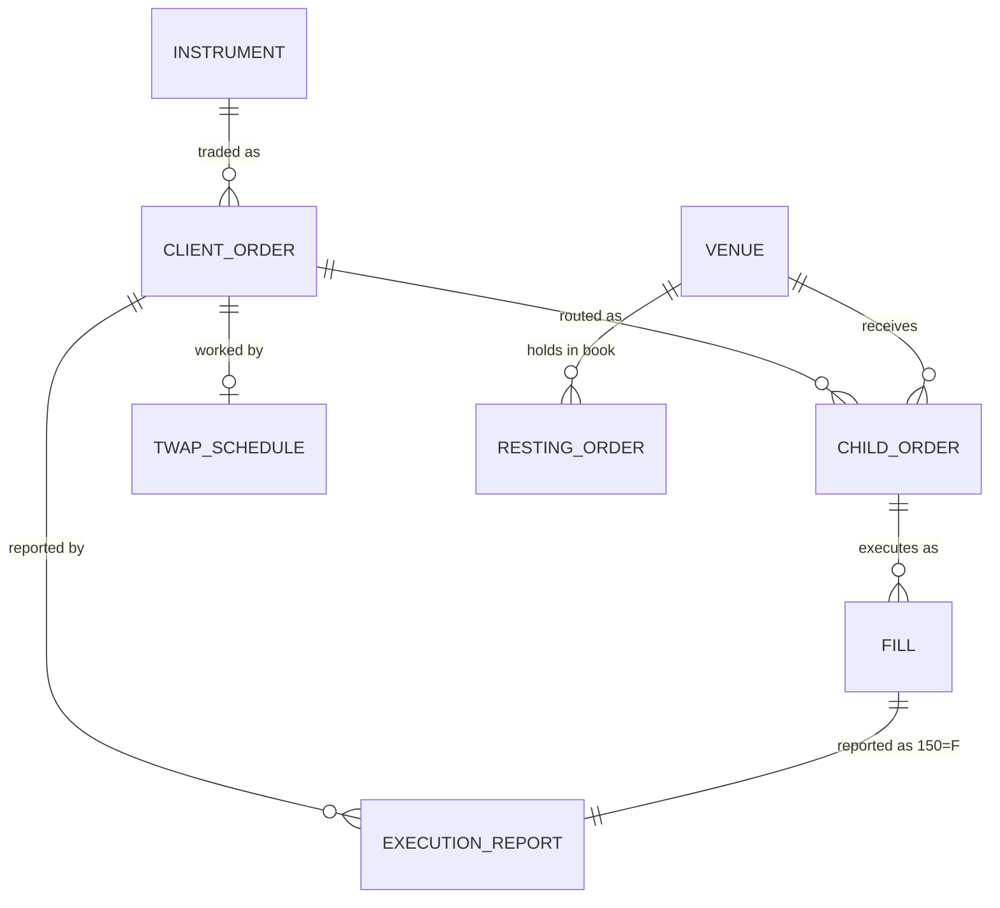

# Data model

## Entities

| Entity | Code | Key fields | Notes |
|---|---|---|---|
| Instrument | `model.Instrument` | symbol (55), security_type (167), maturity (200), put_or_call (201), strike (202) | `key` is the book key: `AAPL`, or `SPY 202612 C 450.00` for an option. Options have multiplier 100. |
| Client order (parent) | `model.Order` | order_id (37), cl_ord_id (11), side (54), qty (38), ord_type (40), price (44), tif (59), status (39), cum_qty (14), notional | `leaves_qty` and `avg_px` are derived, never stored. `cl_ord_id_history` keeps every ClOrdID a cancel/replace retired. |
| Child order | `router.ChildOrder` | ref (`ORD000001-C3`), venue, price, qty, posted | IOC children take liquidity; a posted child rests on one venue for rebate. |
| Venue | `venue.Venue` | mic, take_fee, make_rebate | One book per instrument key. |
| Resting order | `venue.Resting` | ref, is_buy, price, qty, parent_id, seq | `seq` gives time priority; `parent_id` enables self-trade prevention. |
| Fill | `venue.Fill` | venue, ref, parent_id, price, qty, added_liquidity | One per match; drives 30, 31, 32, 851 on the report. |
| Execution report | `engine.Outbound` (35=8) | exec_id (17), exec_type (150), ord_status (39) | Built from the parent order's state at the moment of the event. |
| TWAP schedule | `engine.TwapSchedule` | order_id, slices, interval, next_at, released | Present only while the strategy is working. |

## Identifiers

- **ClOrdID (11)** is the client's. Every cancel or replace brings a new one, and OrigClOrdID (41) points to the one it supersedes. The router indexes an order under every ClOrdID it has had, and refuses a ClOrdID already in use.
- **OrderID (37)** is the router's. It is assigned once and never changes across replaces.
- **ExecID (17)** is unique per report.
