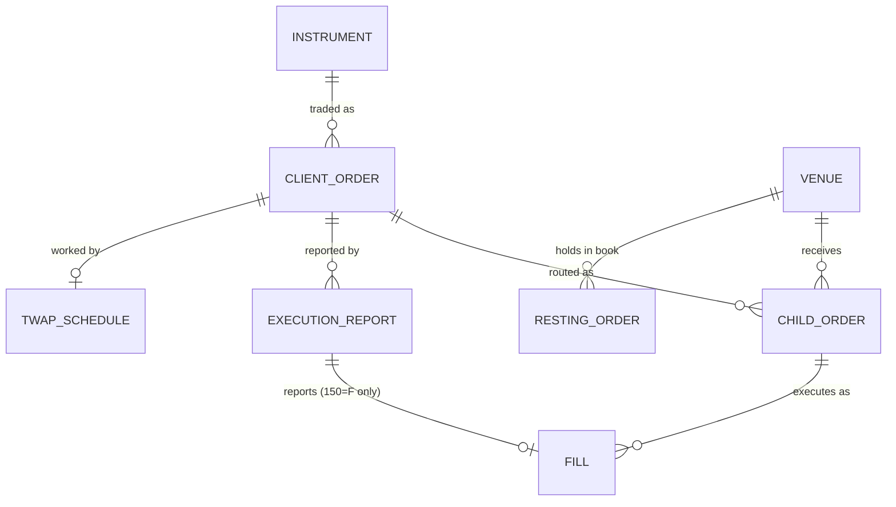

# Data model

## Entities

| Entity | Code | Key fields | Notes |
|---|---|---|---|
| Instrument | `model.Instrument` | symbol (55), security_type (167), maturity (200), put_or_call (201), strike (202) | `key` is the book key, a tuple such as `("CS", "AAPL")` or `("OPT", "SPY", "202612", "1", Decimal("450"))`, so an equity symbol can never match an option and 450.0000001 is a different series. `label` is the readable form, `SPY 202612 C 450`. Options have multiplier 100. |
| Client order (parent) | `model.Order` | order_id (37), cl_ord_id (11), owner (SenderCompID 49), side (54), qty (38), ord_type (40), price (44), tif (59), status (39), cum_qty (14), notional | `leaves_qty` and `avg_px` are derived, never stored. `cl_ord_id_history` keeps every ClOrdID a cancel/replace retired. |
| Child order | `router.ChildOrder` | ref (`ORD000001-C3`), venue, price, qty, posted | IOC children take liquidity; a posted child rests on one venue for rebate. |
| Venue | `venue.Venue` | mic, take_fee, make_rebate | One book per instrument key. |
| Resting order | `venue.Resting` | ref, is_buy, price, qty, parent_id, owner, seq | `seq` gives time priority; `owner` enables self-trade prevention; `parent_id` routes the fill back to its order. |
| Fill | `venue.Fill` | venue, ref, parent_id, price, qty, added_liquidity | One per side of a match that involves one of our orders (two when two of our clients trade with each other); each drives 30, 31, 32, 851 on its order's report. |
| Outbound message | `engine.Outbound` | msg_type, fields, owner | Every message the engine emits (35=8, 35=9, 35=3). For 35=8 the fields carry 17, 150 and 39, built from the order's state at the moment of the event, and `owner` sends it to that client's session only. |
| TWAP schedule | `engine.TwapSchedule` | order_id, slices, interval, next_at, released | Present only while the strategy is working. |

## Identifiers

- **ClOrdID (11)** is the client's, unique per SenderCompID: orders are indexed by (owner, ClOrdID), so two clients can both use C1 and neither can cancel the other's. Every cancel or replace brings a new one, and OrigClOrdID (41) must name the order's current one. The router remembers every ClOrdID an order has had, so none can be reused.
- **OrderID (37)** is the router's. It is assigned once and never changes across replaces.
- **ExecID (17)** is unique per report.
