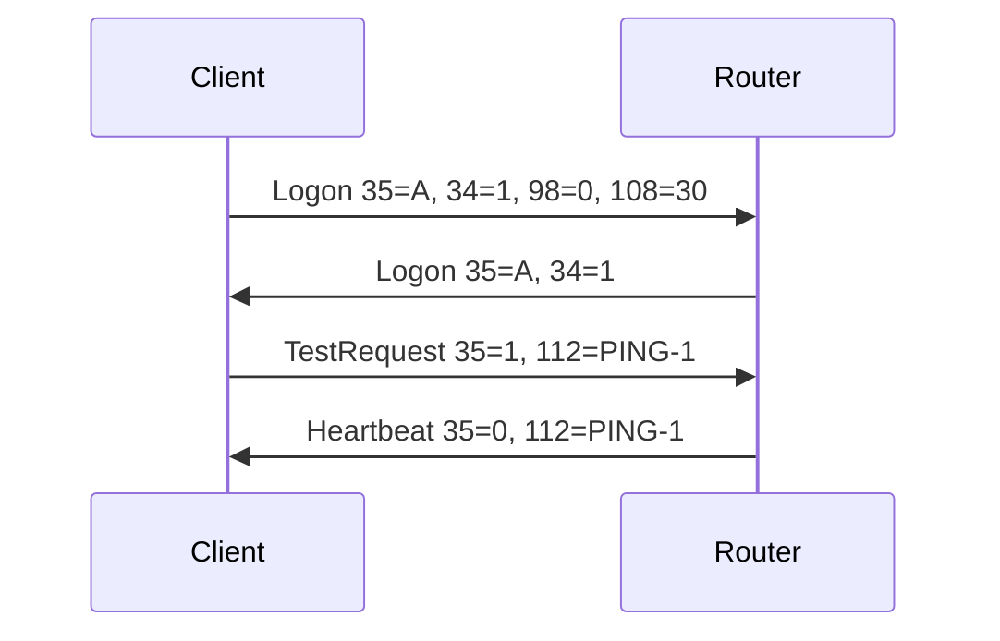
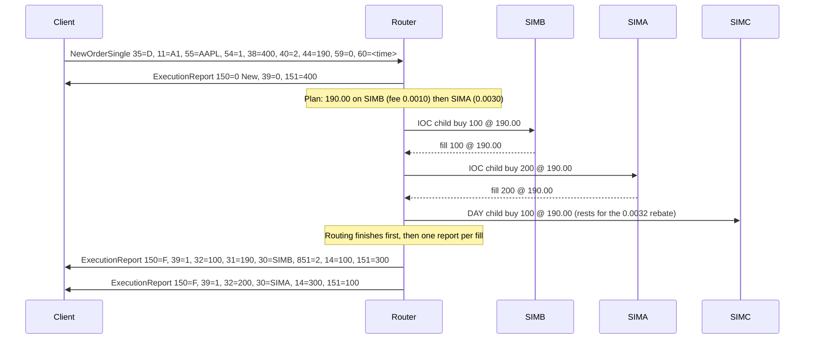
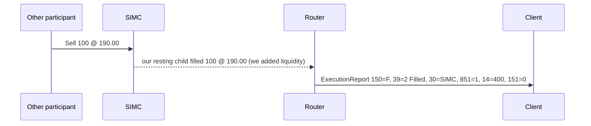
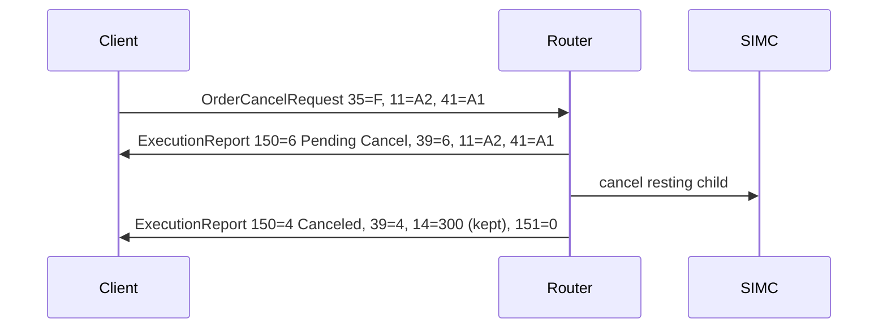
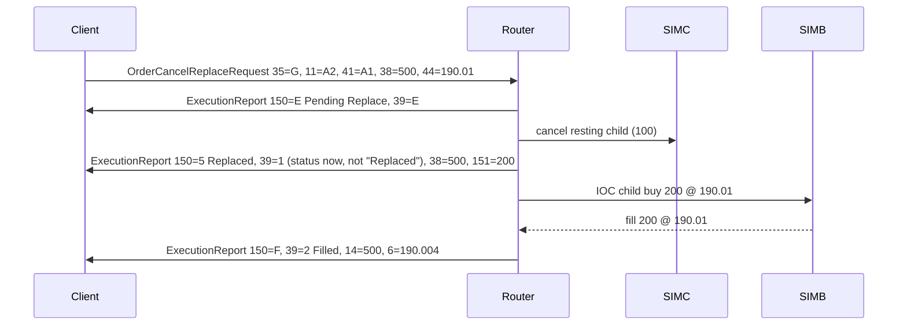
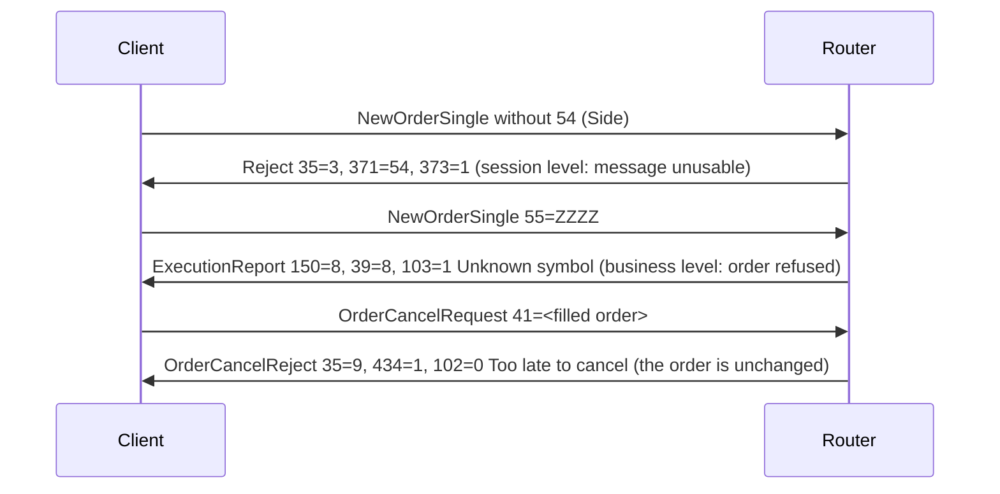
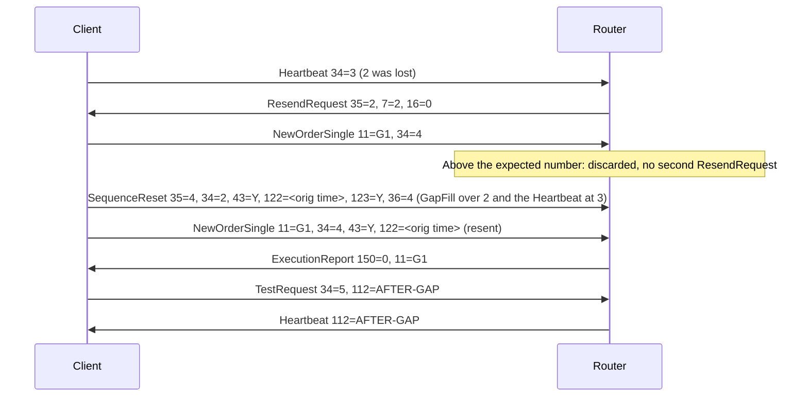

# Message flows

Participants: the **Client** (buy-side OMS), the **Router** (FIX acceptor + order manager + smart order
router), and three simulated venues with different fee models. Prices go on the wire without trailing zeros
(190.00 is sent as 44=190).

| Venue | Take fee | Maker rebate | Role in routing |
|---|---|---|---|
| SIMA | 0.0030 | 0.0020 | Maker-taker |
| SIMB | 0.0010 | 0.0000 | Cheapest to take |
| SIMC | 0.0028 | 0.0032 | Best rebate, so remainders rest here |

## 1. Session start



## 2. New order: sweep the best price, rest the remainder (Buy 400 AAPL @ 190.00 DAY)



## 3. Resting child is hit later



## 4. Cancel



## 5. Cancel/replace



## 6. Three kinds of "no"



## 7. Gap recovery



Session messages (Heartbeat, TestRequest, ResendRequest, Logout, Logon) are gap-filled, never resent;
application messages are resent with PossDupFlag and OrigSendingTime. A ResendRequest or Logout that
arrives above the expected number is acted on at once.

A client's own ResendRequest is answered with SequenceReset 35=4, 43=Y, 122, 123=Y, 36=the number after
the requested range (the next outbound number when 16=0), because the acceptor keeps no message store.

## 8. TWAP (847=1000, 848=slices=3;interval=60)

```mermaid
sequenceDiagram
    participant C as Client
    participant R as Router
    participant A as Venues
    C->>R: NewOrderSingle 38=300, 847=1000, 848=slices=3;interval=60
    R->>C: ExecutionReport 150=0 New
    R->>A: t=0s slice 1: IOC 100
    R->>C: ExecutionReport 150=F, 14=100
    R->>A: t=60s slice 2: IOC ceil(leaves / 2)
    R->>C: ExecutionReport 150=F, 14=200
    R->>A: t=120s slice 3: IOC the rest
    R->>C: ExecutionReport 150=F, 39=2 (or 150=4 Canceled for any unfilled remainder)
```
