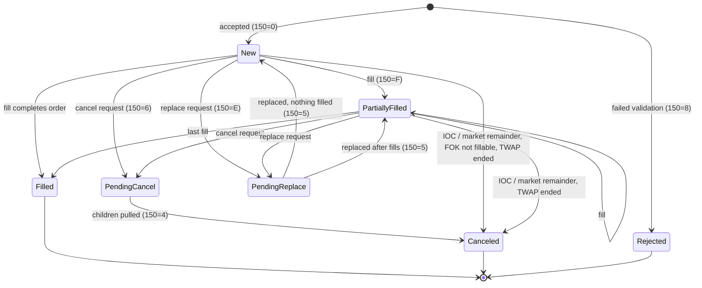

# Order lifecycle

## State machine (OrdStatus, tag 39)

Filled, Canceled and Rejected are terminal. Any transition not drawn raises `InvalidTransition`
(`fixsim/model.py`, `ALLOWED_TRANSITIONS`).

## ExecType (150) vs OrdStatus (39)

ExecType says **what just happened**; OrdStatus says **where the order is now**.

| Event | ExecType 150 | OrdStatus 39 |
|---|---|---|
| Order accepted | 0 New | 0 New |
| Partial fill | F Trade | 1 Partially filled |
| Final fill | F Trade | 2 Filled |
| Cancel requested | 6 Pending cancel | 6 Pending cancel |
| Cancel done | 4 Canceled | 4 Canceled |
| Replace requested | E Pending replace | E Pending replace |
| Replace done | 5 Replaced | 0 or 1, the current state (FIX 4.4 no longer uses 39=5) |
| Rejected | 8 Rejected | 8 Rejected |

## Quantity rules (checked on every report)

- `CumQty (14)` = sum of fill quantities.
- `LeavesQty (151)` = `OrderQty (38) − CumQty` while working; `0` once terminal.
- `AvgPx (6)` = Σ(LastQty × LastPx) ÷ CumQty.

Worked example (message flows 2 and 5): 400 AAPL @ 190.00 fills 300 at 190.00 (Leaves 100, resting on
SIMC). Replace to 500 @ 190.01 cancels the 100 resting, reports Replaced with Leaves 200, then fills 200 at
190.01: CumQty 500, Leaves 0, AvgPx (300 × 190.00 + 200 × 190.01) ÷ 500 = 190.004.
